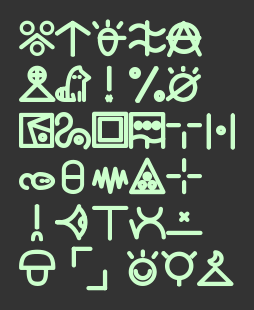

# linja pi tomo lipu

`linja pi tomo lipu` li linja tawa sitelen toki pona kepeken e linja pi lipu e ni: www.tomo-lipu.net

lipu ni li pini, taso jan ale ken lukin e ona kepeken e ni : https://web.archive.org/web/20190222101854/http://www.tomo-lipu.net:80/

~~mi sona ala e jan li pali e ni, taso sina ken toki mi kepeken ilo Telegram/Reddit/Discord #toki-pona-taso~~

jan mama wan pi sitelen ni li jan Kitoputeje (Christophe Bouteiller).

----

`linja pi tomo lipu` is a monotype font to write texts in Toki Pona hieroglyphs.

It was created and used on this website : https://web.archive.org/web/20190222101854/http://www.tomo-lipu.net:80/ (the site is no longer online)

The site used it with optimized svg signs. This is a font conversion.

The author of the 120 vanilla glyphs is Christophe Bouteiller which created also the web site under drupal with a word conversion script. 

Christoph kindly allowed me to reuse his creation, thanks to him !

~~I don't know the author of the site, but I would like to. If someone knows it, contact me by Telegram/Reddit/Discord on channel toki-pona-taso. Then I will update copyright notice.~~

Toki pona is a constructed language using only about 120 words.
0.7 version introduces 32 new words. 

More infos here :
- http://tokipona.org
- http://tokipona.net/tp/janpije/hieroglyphs.php
